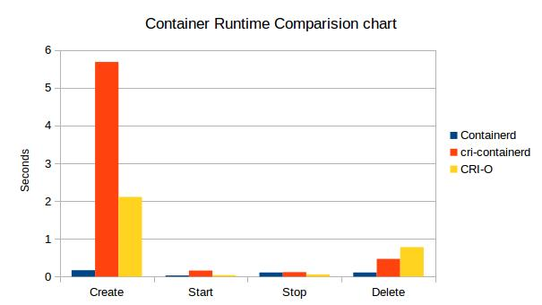

ctr-powertest - _Container runtime test tool_
--------------

Easy and extensible tool for any OCI supported container runtime.

Useful to run same testcases on supported runtimes.

Currently supports 
- [containerd](https://github.com/containerd/containerd) 
    - Status : WIP
      - ``Containerd`` support is 80% completed.
- [k8s CRI](http://blog.kubernetes.io/2016/12/container-runtime-interface-cri-in-kubernetes.html)
    - Any runtime that implementes Kubernetes Container Runtime Interface
    - __Tested for cri-containerd & cri-o__
    - Status : WIP
      - ``CRI`` support is 60% completed.

Usage:

`` ctr-powertest -p <protocol> [-r <runtime>] <test-cases> [flags] [args]``

Usage Example:

`` ctr-powertest -p cri -r cri-containerd stress -t image-pull``


Examples
```
$ sudo ./ctr-powertest -p containerd basic
INFO[0000] Running tests on containerd v1.0.0-beta.1-23-g70b353d.m
INFO[0000] TestPullContainerImage..
INFO[0000] OK..
INFO[0000] TestCreateContainers..
INFO[0000] OK..
INFO[0000] TestCreateRunningContainers..
INFO[0000] OK..
INFO[0000] TestCreateRunningNWaitContainers..
INFO[0006] OK..


$ sudo ./ctr-powertest -p cri -r cri-containerd basic
INFO[0000] Running tests on &VersionResponse{Version:0.1.0,RuntimeName:cri-containerd,RuntimeVersion:1.0.0-alpha.0-35-gd50c610-dirty,RuntimeApiVersion:0.0.0,}
INFO[0000] TestPullContainerImage..
INFO[0003] OK..
INFO[0003] TestCreateContainers..
INFO[0006] OK..
INFO[0006] TestCreateRunningContainers..
INFO[0008] OK..
INFO[0008] TestCreateRunningNWaitContainers..
INFO[0011] OK..
```

Usage:

```
$ sudo ./ctr-powertest --help
container runtime testing tool

Usage:
  ctr-powertest [flags]
  ctr-powertest [command]

Available Commands:
  basic       runs basic tests
  profile     profile container operations.
  stress      Run container tests in parallel (Stress Test)

Flags:
  -d, --debug            debug mode
  -p, --proto string     Protocol [ containerd, cri ] (default "containerd")
  -r, --runtime string   CRI-Runtime [ cri-containerd, crio ] (default "cri-containerd")

```

#### Performace:

Below is some performace numbers as of ``Oct 12, 2017``


* _All using same runc version_

```
runc version 1.0.0-rc4+dev
commit: f53ad9cec928821a25c2a74eb8bd95558f8cf152
spec: 1.0.0
```


#### Important TODO:
- Implement ``Exec`` interface for CRI and containerd.
- Implement ``Wait`` & ``Kill`` for CRI


Contribution , Feedback and reviews are welcome :).
